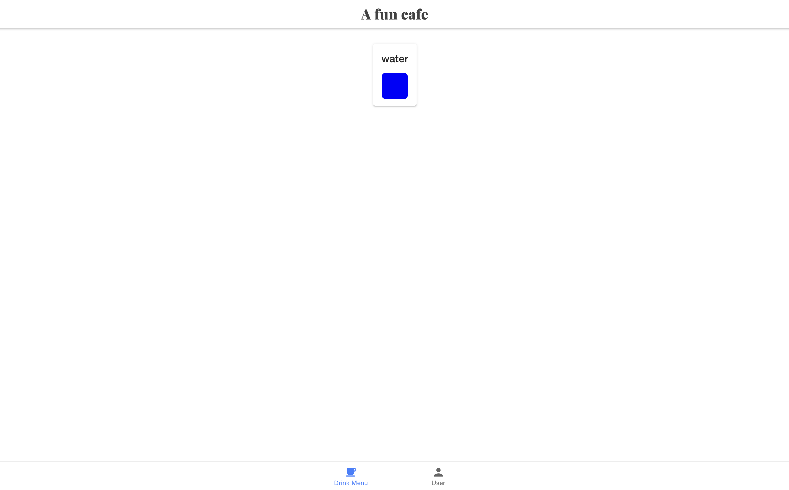
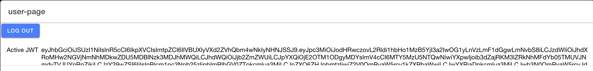
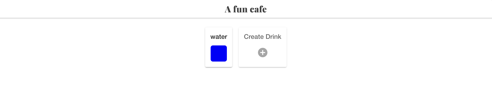
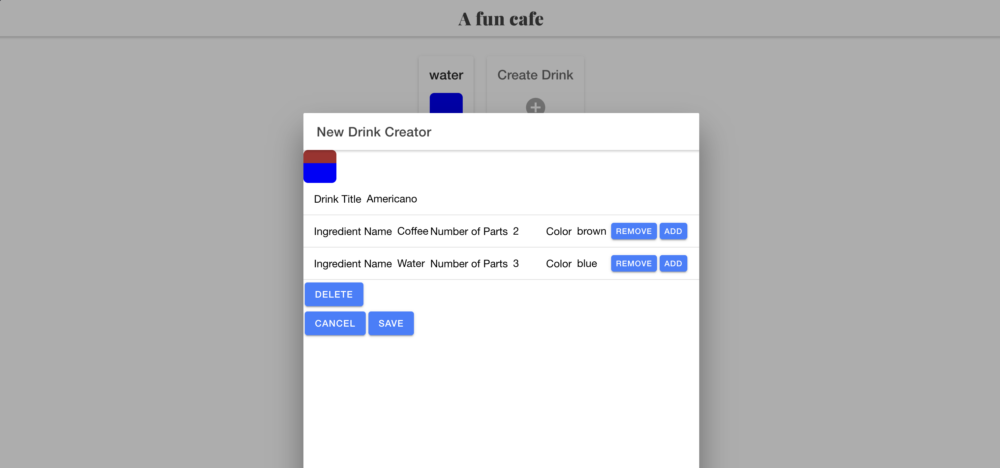
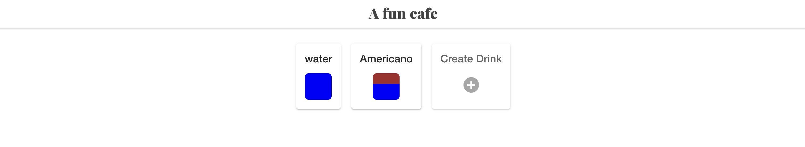
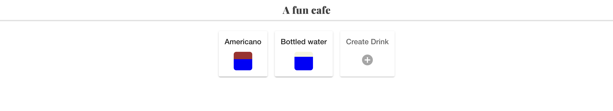
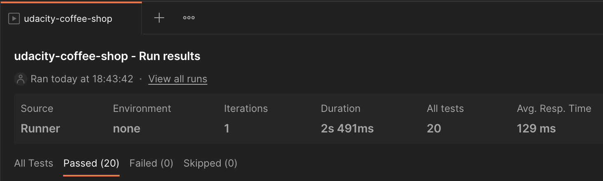

# Coffee Shop with Auth0
## Overview
This project is about a coffee shop where you can view different drinks available in the cafe. 

Just as importantly, it demonstrates the use of authentication and role-based access control (RBAC) in Flask using Auth0, with a test suite written using Postman.

The backend is written in Flask and the frontend is made with Ionic.

For setup instructions:
- [View the README.md within ./backend.](./backend/README.md)
- [View the README.md within ./frontend.](./frontend/README.md)

## Walkthrough
Once we run our backend server and frontend, we can visit `localhost:8100`. 

We are welcomed by a homepage listing a single and eminently low-calorie drink, water.

Note that this is the only API endpoint that is publicly available!

Now, we have two roles set up: Manager and Barista. The manager is allowed to perform all actions (listing, adding, updating, and deleting drinks), whereas baristas are only allowed to list drinks (you read that right, there is no HTTP method for making coffee).

Let's log in using the User menu at the bottom. This will initiate a login using Auth0. The important part is that if I log in with my user account, I will be able to assume the role of Manager (naturally, I gave myself the most powerful permissions). 

Auth0 will return a JWT which we can decode and then parse in all of our endpoints, to check whether I have permission to perform the action. This is the job of the `@requires_permissions` decorator. 

This decorator helps us check whether the user is authenticated - if not, the server will return a 401. If they are authenticated but lack permissions, it returns 403. Other exception handling is done in the route definitions.

Anyway, signing in returns this uninspiring page, which shows us that my identity was verified through Auth0. I can see the JWT I have been assigned.

Returning to the home page, we can see it has updated. I can now create a new drink, because I am authenticated AND authorised to do so, as manager extraordinaire of this establishment:

Let's create a drink. We are going to create an americano. 

Once we hit save, we can see it has been added to the menu:

I can now also use my managerial powers to decide that I would like to delete water from the menu. We want our long-suffering customers to pay for bottled water instead.

Ahem. 

In other words, we can GET, POST, PATCH, and DELETE, based on our neat authentication system. 

## Tests
To run the test suite, import `coffee_shop_full_stack/backend/udacity-coffee-shop.postman_collection.json`. With the server running, run the `udacity-coffee-shop` collection. 

This will comprehensively test all endpoints for the public role (which can only GET `/drinks`), the barista role, and the manager role. All 20 should pass.

